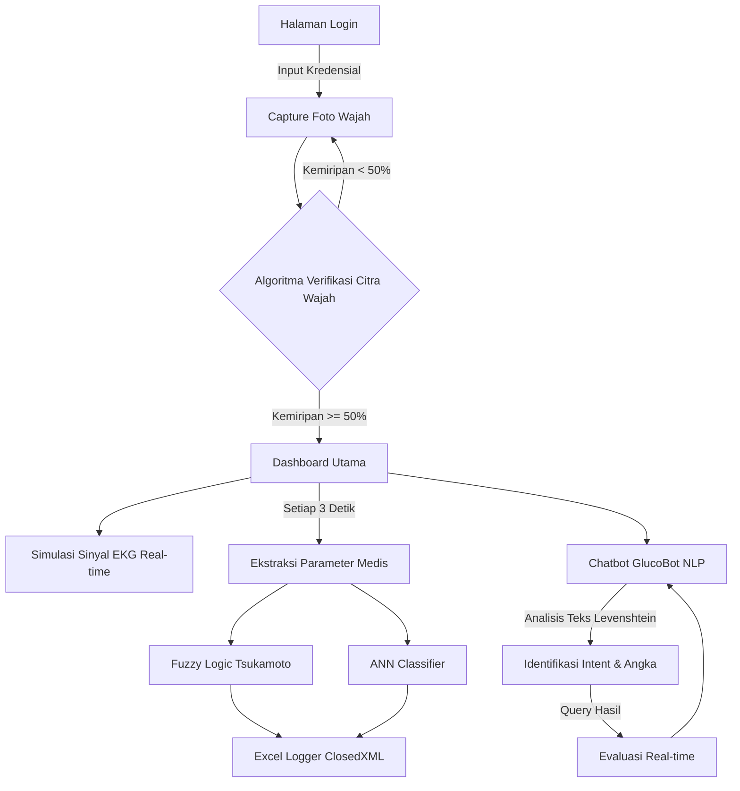

# GlucoPredict & GlucoBot: Sistem Cerdas Pendeteksi Risiko Diabetes & Verifikasi Wajah Dua Faktor

[](https://learn.microsoft.com/en-us/dotnet/maui/)
[](https://learn.microsoft.com/en-us/dotnet/csharp/)
[](https://github.com/mono/SkiaSharp)
[](https://github.com/ClosedXML/ClosedXML)

**Alprogcitra1** adalah aplikasi dashboard pemantauan medis (*biomedical monitoring dashboard*) inovatif yang dikembangkan menggunakan framework **.NET MAUI (.NET 10.0)**. Aplikasi ini dirancang khusus untuk memadukan konsep pemrograman algoritma lanjutan, pemrosesan bahasa alami (NLP), logika fuzzy, jaringan saraf tiruan (ANN), dan pengolahan citra digital (*digital image processing*) yang diimplementasikan sepenuhnya secara manual (*from scratch*) tanpa bergantung pada pustaka Machine Learning pihak ketiga.

---

## Daftar Isi
- [Fitur Utama](#-fitur-utama)
- [Arsitektur Algoritma](#-arsitektur-algoritma)
  - [1. Verifikasi Wajah Dua Faktor (Image Processing)](#1-verifikasi-wajah-dua-faktor-image-processing)
  - [2. Sistem Inferensi Fuzzy Tsukamoto](#2-sistem-inferensi-fuzzy-tsukamoto)
  - [3. Jaringan Saraf Tiruan (ANN) Feedforward](#3-jaringan-saraf-tiruan-ann-feedforward)
  - [4. Natural Language Processing (NLP) & GlucoBot](#4-natural-language-processing-nlp--glucobot)
  - [5. Biomedical Signal Visualizer (SkiaSharp)](#5-biomedical-signal-visualizer-skiasharp)
- [Struktur Proyek](#-struktur-proyek)
- [Persyaratan Sistem & Dependensi](#-persyaratan-sistem--dependensi)
- [Instalasi dan Uji Coba](#-instalasi-dan-uji-coba)
- [Database Excel](#-database-excel)

---

## Fitur Utama

1. **Autentikasi Dua Faktor dengan Pengenalan Wajah**:
   - Setelah masuk dengan username dan password, pengguna wajib melewati verifikasi kamera.
   - Algoritma membandingkan wajah yang tertangkap dengan foto wajah terdaftar menggunakan metode perbandingan nilai keabuan (*grayscale similarity*) piksel demi piksel.
2. **Dashboard Monitoring Real-time**:
   - Menampilkan grafik sinyal denyut jantung analog dinamis dengan visualisasi real-time berbasis *SkiaSharp canvas*.
   - Simulasi ekstraksi parameter klinis (Glukosa dan Detak Jantung) setiap 3 detik.
3. **Mesin Prediksi Diabetes Ganda**:
   - **Logika Fuzzy (Tsukamoto)** untuk menentukan skor risiko glukosa darah dan menghasilkan rekomendasi medis interaktif.
   - **Artificial Neural Network (ANN)** yang menggunakan 4 fitur klinis utama untuk memprediksi kelas status kesehatan.
4. **Asisten GlucoBot (NLP Chatbot)**:
   - Chatbot medis interaktif yang terpasang langsung pada dashboard.
   - Mampu mengekstrak nilai glukosa dari obrolan, mengklasifikasi maksud (*intent*), dan memberikan laporan status klinis real-time pasien menggunakan kombinasi NLP + Fuzzy + ANN.
5. **Database Riwayat Berbasis Excel**:
   - Menyimpan setiap riwayat pengecekan pasien secara otomatis ke spreadsheet Excel (`DatabasePasien.xlsx` di folder dokumen lokal) menggunakan library `ClosedXML`.

---

## Arsitektur Algoritma

Aplikasi ini mendemonstrasikan kekuatan struktur algoritma C# murni untuk tugas-tugas cerdas:



### 1. Verifikasi Wajah Dua Faktor (Image Processing)
Algoritma pencocokan gambar wajah bekerja dengan memproses bitmap gambar yang diambil langsung dari kamera (`MediaPicker`) dan mencocokkannya dengan gambar referensi pendaftaran yang disimpan di penyimpanan lokal (`AppDataDirectory`).
* **Downsampling Citra**: Kedua gambar (dari database dan kamera) di-resize menjadi resolusi sangat rendah sebesar **16x16 piksel** (total 256 piksel) untuk menghemat komputasi dan mengurangi noise spasial.
* **Konversi Skala Keabuan (Grayscale)**: Setiap piksel dikonversi menjadi representasi nilai keabuan menggunakan formula luminansi standar:
  $$Gray = 0.3 \cdot R + 0.59 \cdot G + 0.11 \cdot B$$
* **Pencocokan Nilai Ambang (Threshold Similarity)**: Selisih absolut nilai keabuan tiap piksel pada koordinat $(x, y)$ dihitung. Piksel dianggap "cocok" jika selisihnya di bawah batas toleransi:
  $$\Delta Gray = |Gray_{\text{kamera}} - Gray_{\text{db}}| < 50$$
* **Kriteria Penerimaan**: Jika jumlah piksel cocok $\ge 50\%$ dari total 256 piksel, kecocokan disetujui dan akses ke dashboard dibuka.

---

### 2. Sistem Inferensi Fuzzy Tsukamoto
Sistem fuzzy ini mengukur risiko berdasarkan input tingkat glukosa darah (mg/dL) pasien:

#### **Fungsi Keanggotaan (Membership Functions)**
Menggunakan model representasi grafik Segitiga dan Trapesium:
- **Hipoglikemia** (Gula Rendah): Trapesium $[0, 0, 50, 70]$
- **Normal** (Sehat): Segitiga $[60, 85, 110]$
- **Prediabetes** (Waspada): Segitiga $[95, 113, 130]$
- **Diabetes** (Tinggi): Segitiga $[120, 163, 200]$
- **Hiperglikemia Kritis** (Darurat): Trapesium $[180, 220, 400, 400]$

#### **Aturan Fuzzy & Defuzzifikasi**
Tiap fungsi keanggotaan memiliki konsekuen output tegas ($z$) sesuai metode Tsukamoto:
1. *Jika Hipoglikemia*, maka Risiko ($z_1$) = $75$ (Darurat Gula Rendah)
2. *Jika Normal*, maka Risiko ($z_2$) = $10$ (Aman)
3. *Jika Prediabetes*, maka Risiko ($z_3$) = $50$ (Waspada)
4. *Jika Diabetes*, maka Risiko ($z_4$) = $80$ (Tinggi)
5. *Jika Hiperglikemia Kritis*, maka Risiko ($z_5$) = $100$ (Kritis)

Output riil skor risiko akhir ($z^*$) dihitung melalui rata-rata berbobot derajat keanggotaan ($\alpha$):
$$z^* = \frac{\sum_{i=1}^{n} \alpha_i \cdot z_i}{\sum_{i=1}^{n} \alpha_i}$$

---

### 3. Jaringan Saraf Tiruan (ANN) Feedforward
Jaringan Saraf Tiruan diimplementasikan secara manual untuk klasifikasi multi-kelas dengan arsitektur **4 Input $\rightarrow$ 8 Hidden Neurons $\rightarrow$ 3 Output Classes**.
- **Fitur Input**: $[Glukosa, Detak Jantung, Usia, BMI]$
- **Label Output**: $[Normal, Prediabetes, Diabetes]$

#### **Alur Forward Propagation**
1. **Normalisasi Min-Max Scaling**: Mengubah nilai input aktual ke dalam skala $[0, 1]$ agar performa neuron stabil:
   $$x_{\text{norm}} = \frac{x - x_{\text{min}}}{x_{\text{max}} - x_{\text{min}}}$$
2. **Hidden Layer Activation**: Mengalikan input ternormalisasi dengan bobot penghubung ($W_{IH}$), ditambah bias ($b_H$), kemudian diaktivasi menggunakan fungsi **Sigmoid**:
   $$h_j = \frac{1}{1 + e^{-\left(\sum_{i=1}^{4} x_i \cdot w_{ij} + b_j\right)}}$$
3. **Output Layer & Softmax**: Nilai keluaran dari hidden layer dikalikan dengan bobot output ($W_{HO}$), ditambah bias output ($b_O$). Untuk mendapatkan probabilitas kelas, fungsi **Softmax** diterapkan pada logits output:
   $$P(\text{Kelas}_k) = \frac{e^{z_k}}{\sum_{m=1}^{3} e^{z_m}}$$
   *Bobot Jaringan (Weights & Bias) di-inisialisasi berdasarkan hasil pre-training offline menggunakan Pima Indians Diabetes Dataset.*

---

### 4. Natural Language Processing (NLP) & GlucoBot
GlucoBot memproses instruksi atau pertanyaan natural dari pengguna menggunakan taksonomi NLP sederhana:
* **Tokenisasi & Penghapusan Stopwords**: Menghapus kata-kata umum Bahasa Indonesia (seperti *yang, di, ke, aku, kamu, apakah, sih, nih*) untuk menyisakan kata kunci bermakna.
* **Klasifikasi Intent Fuzzy Keyword**: Menggunakan algoritma **Levenshtein Distance** untuk mencocokkan kemiripan fonetik/penulisan kata kunci input dengan database pola intent:
  $$\text{Similarity}(s_1, s_2) = 1 - \frac{\text{Levenshtein}(s_1, s_2)}{\max(|s_1|, |s_2|)}$$
  *(Toleransi kemiripan diatur pada ambang batas > 70%).*
* **Ekstraksi Entitas**: Menggunakan Regular Expressions (Regex) untuk mendeteksi angka numerik yang disebutkan oleh user di dalam chat, lalu secara otomatis memvalidasi angka tersebut sebagai parameter input glukosa yang akan langsung dianalisis oleh Fuzzy Logic dan ANN.

---

### 5. Biomedical Signal Visualizer (SkiaSharp)
Menggunakan kontrol `GraphicsView` dari .NET MAUI dan engine gambar `SkiaSharp` untuk menggambar denyut jantung analog real-time.
- Sinyal EKG disimulasikan secara dinamis menggunakan persamaan gelombang sinus yang digabungkan dengan komponen noise acak frekuensi tinggi:
  $$S(t) = \sin(t) + 0.2 \cdot \sin(10t)$$
- Array titik sinyal digambar terus menerus pada kanvas dengan visualisasi garis neon meliuk (*anti-aliased stroke*) untuk memberikan efek estetika medis modern.

---

## Struktur Proyek

```text
Alprogcitra1/
│
├── Alprogcitra1.slnx             # File Visual Studio Solution XML
└── Tugas Alprog/                 # Folder Utama Source Code Project MAUI
    ├── Alprogcitra1.csproj       # Project SDK Configuration (.NET 10.0 MAUI)
    ├── App.xaml / App.xaml.cs    # Entry point aplikasi
    ├── AppShell.xaml             # Kerangka navigasi
    │
    ├── Models/                   # Model Data
    │   └── ChatMessage.cs        # Model untuk representasi data Chatbot, NLP, Fuzzy & ANN Result
    │
    ├── Services/                 # Implementasi Algoritma Cerdas (Engine Utama)
    │   ├── AnnService.cs         # Engine Jaringan Saraf Tiruan (Feedforward)
    │   ├── FuzzyLogicService.cs  # Engine Logika Fuzzy Tsukamoto
    │   ├── NlpService.cs         # Engine NLP & Levenshtein Distance
    │   ├── ChatbotService.cs     # Orkestrator Chatbot & GlucoBot
    │   └── ExcelDatabaseService.cs # Engine Penyimpanan Excel (ClosedXML)
    │
    ├── Platforms/                # Kode Spesifik Platform OS (Android, iOS, Windows, Mac)
    ├── Resources/                # Aset gambar, font, ikon, splash screen
    │
    └── Halaman View (XAML & C#):
        ├── MainPage.xaml         # UI Login Sistem
        ├── RegisterPage.xaml     # UI Registrasi & Pendaftaran Wajah
        ├── FaceVerificationPage.xaml # UI Verifikasi Wajah 2FA
        └── MainDashboardPage.xaml # UI Dashboard Utama Pemantauan Pasien & Chatbot
```

---

## Persyaratan Sistem & Dependensi

* **Framework Target**: `.NET 10.0 MAUI`
* **IDE**: Visual Studio 2022 (v17.12+) dengan beban kerja *.NET Multi-platform App UI development*.
* **Package NuGet**:
  - `ClosedXML` (v0.105.0) — Library pembuatan spreadsheet Excel open-source.
  - `SkiaSharp.Views.Maui.Controls` (v3.119.2) — Engine rendering grafik 2D performa tinggi pada kanvas.
  - `Microsoft.Extensions.Logging.Debug` (v10.0.0) — Log sistem debug.

---

## Instalasi dan Uji Coba

1. **Clone repositori**:
   ```bash
   git clone https://github.com/USERNAME/Alprogcitra1.git
   cd Alprogcitra1
   ```
2. **Restore NuGet Packages**:
   ```bash
   dotnet restore "Alprogcitra1/Tugas Alprog/Alprogcitra1.csproj"
   ```
3. **Jalankan Aplikasi** (Melalui Windows Machine):
   ```bash
   dotnet build "Alprogcitra1/Tugas Alprog/Alprogcitra1.csproj" -t:Run -f net10.0-windows10.0.19041.0
   ```
   *(Atau buka file solusi `.slnx` melalui Visual Studio 2022, pilih platform target Windows/Android, lalu tekan **F5**).*

---

## Database Excel

Aplikasi menyimpan seluruh data rekam medis pasien secara otomatis. Anda dapat memantau log hasil analisis di:
**`C:\Users\<UsernameAnda>\Documents\DatabasePasien.xlsx`**

Data disimpan dalam format tabel terstruktur yang memuat informasi berikut:
* **Waktu**: Tanggal & jam perekaman
* **Nama Pasien** & **ID Pasien**: Data identifikasi operator
* **Detak Jantung (bpm)**: Parameter detak jantung terukur/tersimulasi
* **Glukosa (mg/dL)**: Parameter kadar gula terukur/tersimulasi
* **Fuzzy Risk Level**: Kategori klasifikasi fuzzy (Rendah, Sedang, Tinggi, Kritis)
* **ANN Prediction**: Hasil klasifikasi kelas Jaringan Saraf Tiruan (Normal, Prediabetes, Diabetes)
